## 总体概念
SD是一个文生图/文+图生图的经典开源模型，一下是阅读论文解析零基础部分的心得
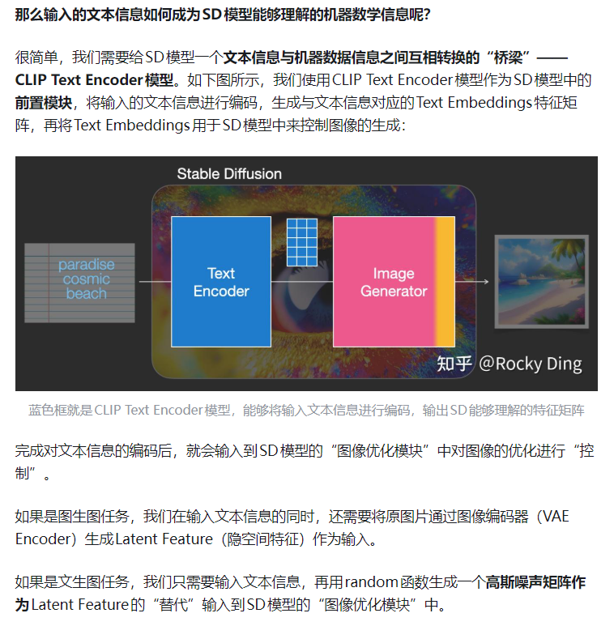
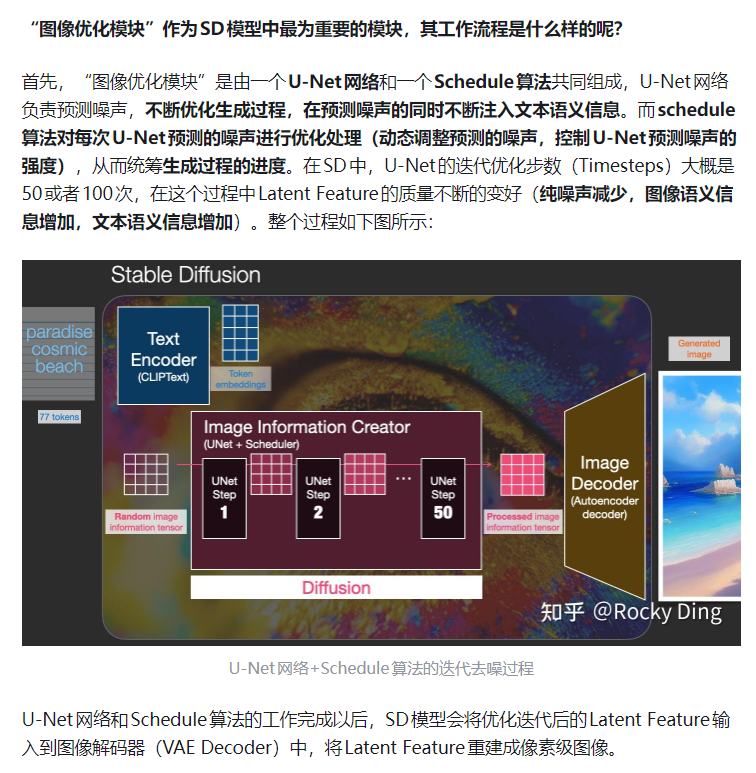
### 前向扩散与反向扩散
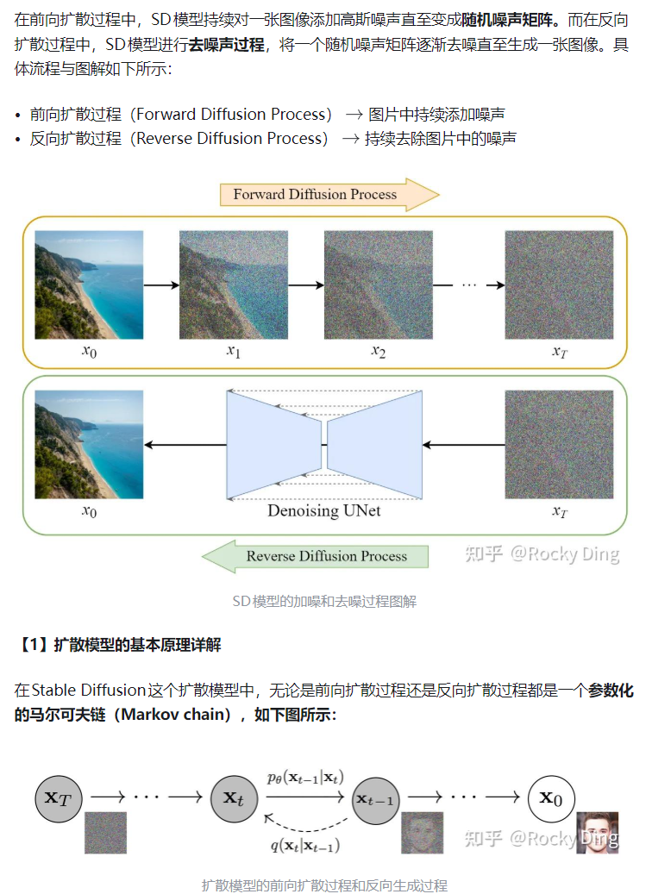
前向扩散可视为K步的不断向图片上叠加噪声，而反向扩散正好相反，是一个多步去除噪声的过程
下面补充一个关于高斯噪声的知识点
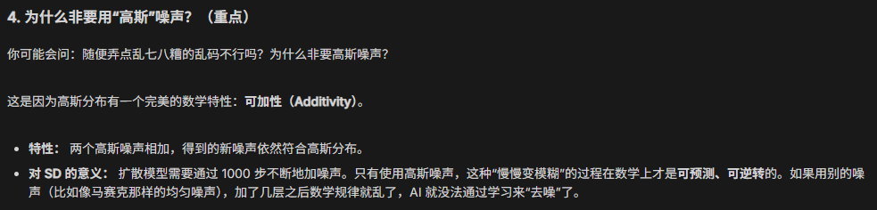
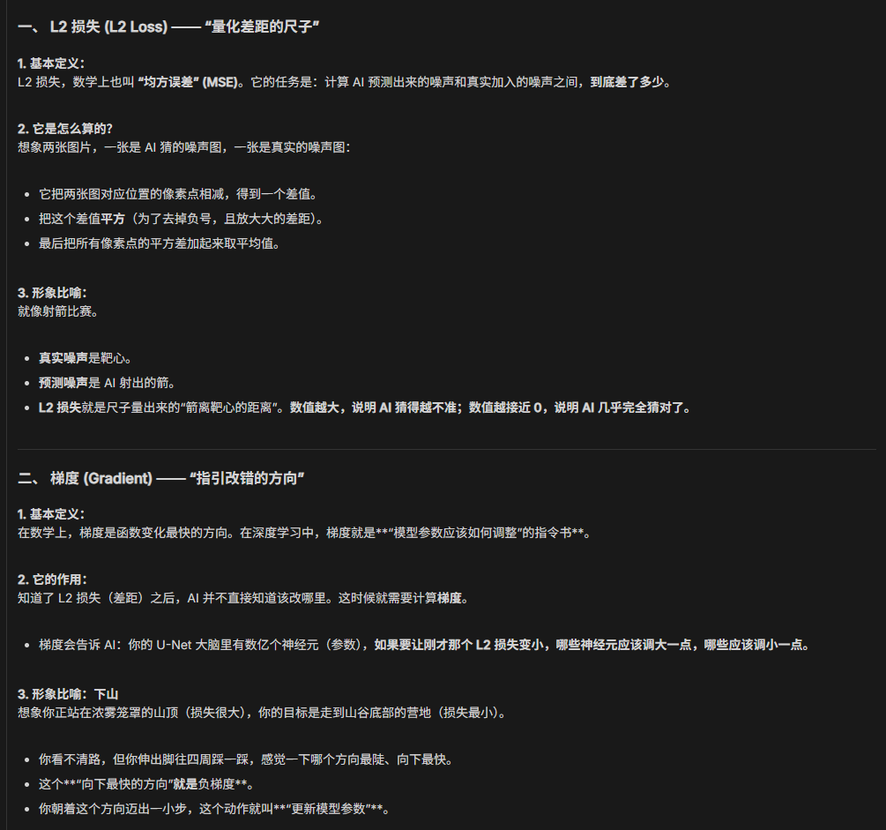
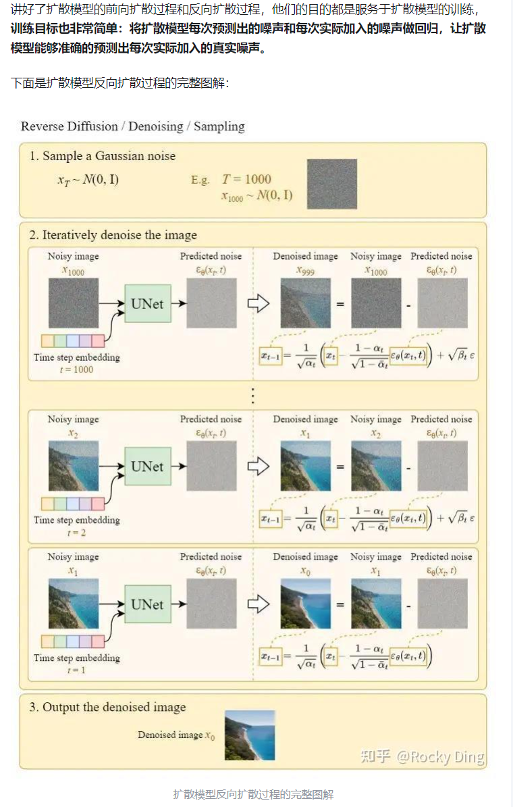
这张图片很重要，其实体现了不少东西
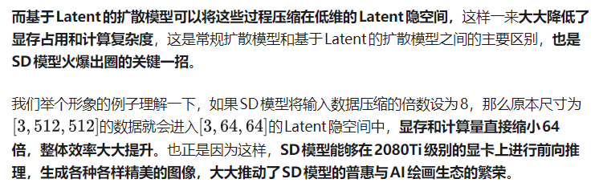
latent能够减少图片占用和算力耗费
3，512，512格式意义为3通道512x512的图片
### 训练流程
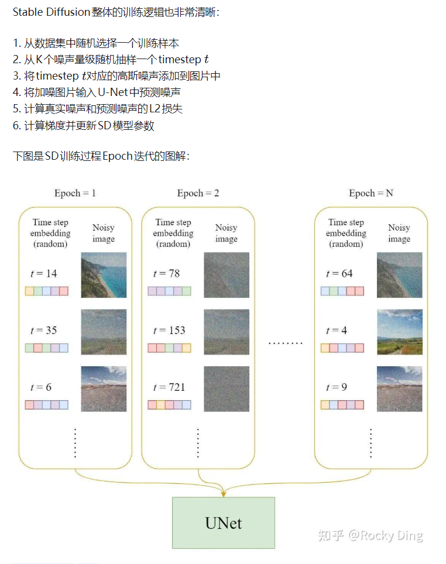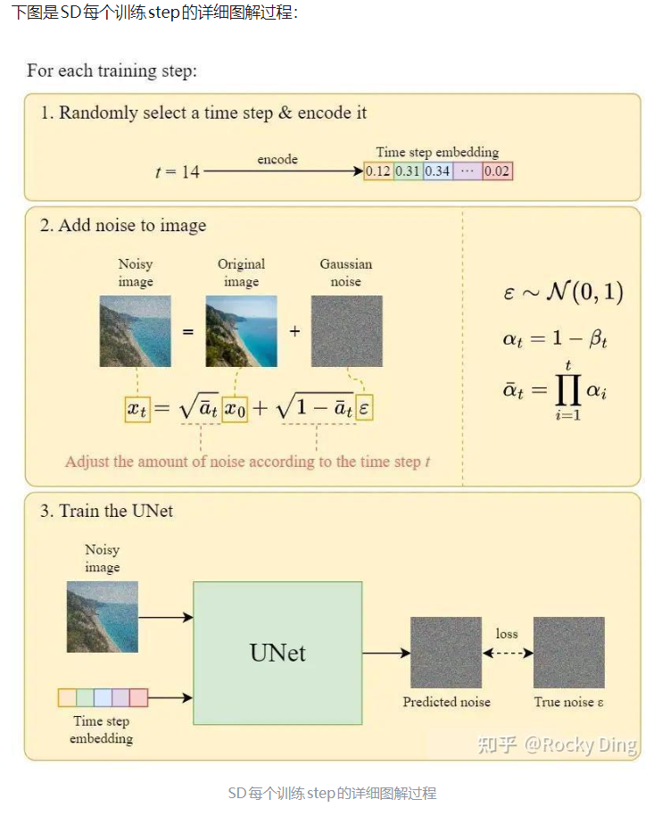
首先我们要知道，虽然理论上噪声是一点点叠加上去的，但是实际训练中我们实际上是直接生成了K强度的噪声来叠加到原图上，把得到图片，图片标签和噪声强度作为训练数据喂给模型，然后模型尝试给出的推测数据也是尝试直接将得到图片还原为原图的预测噪声（即一步到位直接还原成原图）
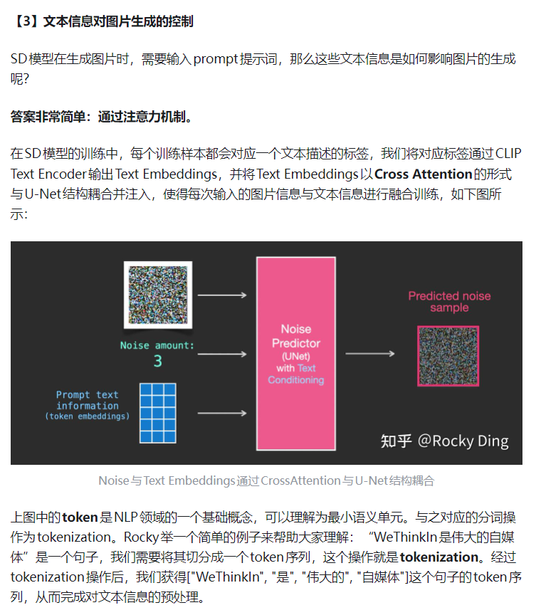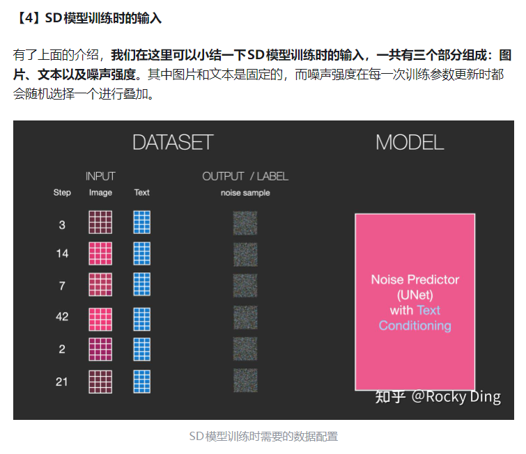
我们可以总结一下，训练模型时输入得到图片，图片标签（文字）和噪声强度，那么使用时呢？
使用时我们也输入文字，图片（默认噪声图或者你的图片），而噪声强度隐含在U-net的运行过程中，比如运行50轮，噪声总等级为1000，那么就是1000，980，960...
这时出现一个问题，我们训练时预测，是要尝试一下还原所有噪声的（0->500->0）,实际使用却是一步步还原出图片，这很反直觉
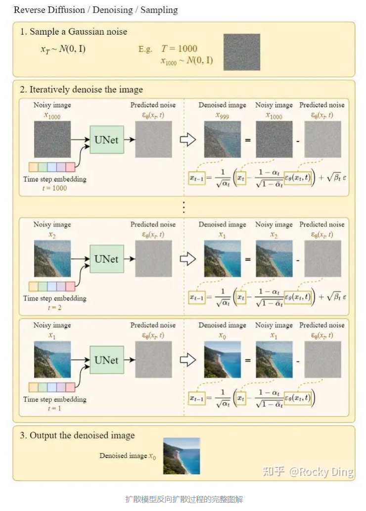
观察图中的公式，我们可以得到启发，模型对输入噪声等级为1000的一张图片给出对应的预测噪声（相当于一个还原方向），我们不是直接使用了整个预测噪声，而是使用了一个极小系数x预测噪声（相当于往这个方向走了一小步），这样实现了一点点生成/还原图片